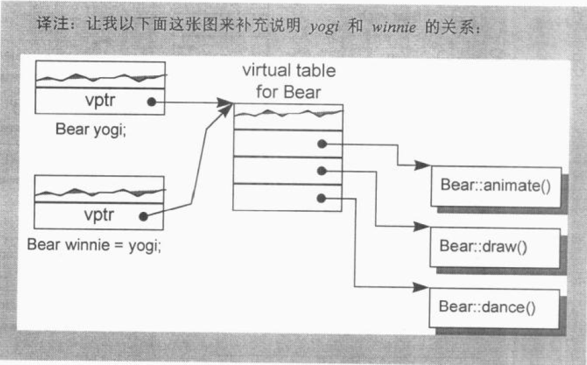
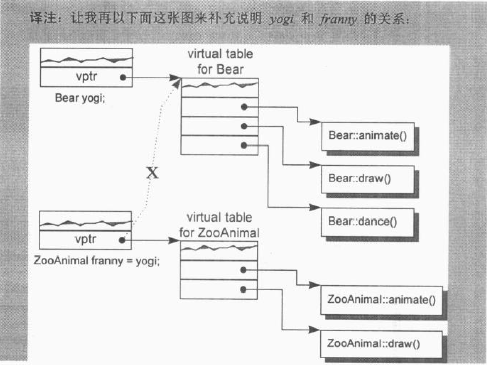

#### 构造函数(Copy Constructor)的构建操作

有三种情况，会以一个object的内容作为另一个class object的初值。

- 对一个object做明确的初始化操作

``` cpp
class X{ ... };

X x;

// 明确地以一个object的内容作为另一个class object的初值
X xx=x;
```

- 当object被当做参数交给某个函数时

```cpp
extern void foo(X x);

void bar()
{
  X xx;
  
  // 以xx作为foo()第一个参数的初值（不明显的初始化操作）
  foo(xx);
  // ...
}
```

- 当函数传回一个class object时

``` cpp
X
foo_bar()
{
  X xx;
  // ...
  return xx;
}
```

假设class设计者明确定义了一个copy constructor（这是一个constructor,有一个参数类型是其class type).

例

``` cpp
// user-defined copy constructor的实例
// 可以是多参数形式，其第二参数及后及参数以一个默认值供应之
X::X(const X& x);
Y::Y(const Y& y,int =0);
```

那么在大部分情况下，当一个class object以另一个同类实体作为初值时，上述的constructor会被调用。这可能会导致一个暂时性class object的产生或程序代码的蜕变（或两者都有)。


#### Default Memberwise Initialization （默认逐一成员复制）

如果class没有提供一个明显的拷贝构造函数（explicit copy constructor，即当class object以“相同class的另一个object”作为初值）的时候，内部是以所谓的default memberwise initialization(默认逐一成员复制)手法完成的。


default memberwise initialization ：就是把每一个内建的或派生的数据成员（data member例如一个指针或以数组的值，从某个object拷贝一份到另一个object身上。不过它并不会拷贝其中的成员类对象（member class object），而是以递归的方式实行逐一成员初始化（memberwise initialization）。

例

``` cpp
class String{
  public:
  	// ... 没有显式的构造函数（explicit copy constructor）
  private:
  	char *str;
  	int len;
};
```

一个String object的默认逐一成员初始化（default memberwise initialization）发生在下面这种情况：

``` cpp
String noun("book");
String verb=noun;
```

其完成方式就好像逐一设置每个members一样：

``` cpp
// 语意相等
verb.str = noun.str;
verb.len = noun.len;
```

如果一个String object被声明为另一个class的member，像下面这样：

``` cpp
class Word{
  public:
  	// ... 没有显式拷贝构造函数(explicit copy constructor)
  private:
  	int _occurs;
  	String _word; // String object 成为class Word的一个member
};
```

那么一个Word object的默认逐一成员拷贝(default memberwise initialization)会拷贝其内建的member _occurs，然后再在String member object _word身上递归实施memberwise initialization(逐一成员初始化)。


> 一个class object 可以从两种方复制完成得到：
>
> - 被初始化 (copy constructor)
> - 被指定 (copy assignment operator)


就像默认构造函数(default constructor)一样，如果class没有声明一个拷贝构造函数(copy constructor)，就会有隐含的声明(implicitly declared)或隐含的定义(implicitly defined)出现。

C++标准(C++ Standard)把拷贝构造函数(copy constructor)区分为没有用的(trivial)和(nontrivial)两种。

只有**nontrivial**的实体才会被合成与程序之中。


#### BitWise Copy Semantics（位逐次拷贝）

``` cpp
#include "Word.h"

Word noun("book")
  
void foo()
{
  Word verb = noun;
  // ...
}
```

在上面的程序段中，很明显verb是根据noun来初始化。但是在尚未看过class Word的声明之前，我们不可能预测这个初始化操作的程序行为。如果class Word的设计者定义了一个拷贝构造函数(copy constructor)，verb的初始化操作会调用它。

但如果该class没有定义显式的拷贝构造函数，那么是否会有一个编译器合成的实体被调用呢？

这就得视该class是否展现位逐次拷贝("bitwise copy semantics")而定了。

例

``` cpp
// 以下声明展现了位逐次拷贝(bitwise copy semantics)
class Word{
  public:
  	Word(const char*);
  	~Word(){delete []str;}
  	// ...
  private:
  	int cnt;
  	char *str;
};
```

上面这种情况并不需要合成一个默认拷贝构造函数(default copy constructor),因为上述声明展现了默认逐次拷贝(default copy semantics)，而verb的初始化操作也就不需要以一个函数调用收场。


需要注意的是：

> 如今local object verb和global object noun都指向相同的字符串。在退出foo()之前，local object verb会执行虚构函数(destructor)，于是字符串被删除，global object noun从此指向一堆无意义之物。member str的问题只能够靠”由class设计者实现出一个显式构造函数(explicit copy constructor)以改写默认逐一成员初始化(default memberwise initialization)或是靠“不允许完全拷贝”解决之。
>
> 不过这和“是否有一个copy constructor 被编译器合成出来”没有关系。


然而，如果class Word是这样声明：

``` cpp
// 以下声明并未展现出位逐次拷贝（bitwisse copy semantics）
class Word{
  public:
  	Word(const String&);
  	~Word();
  	// ...
  private:
  	int cnt;
  	String str;
};

// 其中String声明了一个显式构造函数(explicit copy constructor)
class String{
  public:
  	String(const char *);
  	String(const String&);
  	~String();
  // ...
};
```

在这个情况下，编译器必须合成一个拷贝构造函数(copy constructor)以便调用member class String object的copy constructor：

``` cpp
// 一个被合成出来的copy constructor
// C++ 伪码
inline Word::Word(const Word& wd)
{
  str.String::String(wd.str);
  cnt=wd.cnt;
}
```

值得注意的是：在这被合成出来的copy constructor中，如整数，指针，数组等等的nonclass members也都会被复制，正如我们所期待的一样。

#### 不要位逐次拷贝(Bitwise Copy Semantics)

当出现下面四种情况的时候，一个class不展现出位逐次拷贝：

- 当class内含一个成员对象(member object)，而后者的class声明有一个拷贝构造函数(copy constructor)时 （无论是否明确声明或被合成所得）；
- 当class继承自一个base class，而后者存在有一个拷贝构造函数(copy constructor)时（再次强调，无论是否明确声明或被合成所得）；
- 当class声明了一个或多个virtual functions时；
- 当class派生自一个继承串链，其中有一或多个virtual base classes时。

前面两种情况中，编译器必须将member或base class的 ”拷贝构造函数调用操作“ 安插到被合成的拷贝构造函数中。

接下来要讨论的就是上述情况3和4。

#### 重新设定Virtual Table的指针

编译期间的两个程序扩张操作（只要有一个class声明了一个或多个virtual functions就会如此）

- 增加一个virtual function table(vtbl)，内含每一个有作用的virtual function的地址。
- 将一个指向virtual function table的指针（vptr），安插在每一个class object内。

显然，如果编译器对于每一个新产生的class object的vptr不能成功而正确地设好其初值，将导致可怕的后果。因此，当编译器导入一个vptr到class之中，该class就不再展现bitwise semantics了。现在，编译器需要合成出一个拷贝构造函数（copy constructor），以求将vptr适当地初始化。

例：

``` cpp
// 首先，我定义两个classes,ZooAnimal和Bear:
class ZooAnimal{
  public:
  	ZooAnimal();
  	virtual ~ZooAnimal();
  
  	virtual void animate();
  	virtual void draw();
  
  	// ...
  private:
  	// ZooAnimal的animate()和draw()所需要的数据
};

class Bear:public ZooAnimal{
  public:
  	Bear();
  	void animate();	// 虽未明写virtual，它其实是virtual
  	void draw();	// 同上
  	virtual void dance();
  	// ...
  
  private:
  	// Bear的animate()和draw()和dance()
  	// 所需要的数据
};

```

ZooAnimal class object以另一个ZooAnimal class object，或者Bear class object以另一个Bear class object作为初值，都可以直接靠"bitwise copy semantics"完成。

例：

``` cpp
Bear yogi;
Bear winnie=yogi;
```

yogi会被default Bear constructor初始化。而在constructor中，yogi的vptr被设定指向Bear class的virtual table（靠编译器安插的代码完成）。因此，把yogi的vptr值拷贝给winnie的vptr是安全的。



当一个base class objec以其派生类(derived class)的内容做初始化操作时，其vptr复制操作也必须保证安全。

例：

``` cpp
ZooAnimal franny=yogi;	// 会发生切割(sliced)行为
```

franny的vptr不可以设定指向Bear class的virtual table（但如果yogi的vptr被直接“bitwise copy”的话，就会导致此结果），否则当下面程序片段中的draw()被调用而franny被传进去时，就会“炸毁（blow up)。”

```cpp
void draw(const ZooAnimal& zoey){zoey.draw();}

void foo(){
  // franny的vptr指向ZooAnimal的virtual table，
  // 而非Bear的virtual table（彼由yogi的vptr指出）
  ZooAnimal franny=yogi;
  
  draw(yogi); // 调用Bear::draw()
  draw(franny); // 调用ZooAnimal::draw();
}
```



就是说，合成出来的ZooAnimal 拷贝构造函数(copy constructor)会明确设定object vptr指向ZooAnimal class的virtual table，而不是直接从右手边的class object中将其vptr现值拷贝过来。


注意的是：

> 通过franny调用virtual function draw()，调用的是ZooAnimal实体而非Bear实体（甚至虽然franny是以Bear object yogi作为初值），因为franny是一个ZooAnimal object。事实上，yogi中的Bear部分已经在franny初始化时被切割(sliced)掉了。如果franny被声明为一个reference（或如果它是一个指针，而其值为yogi的地址），那么经由franny所调用的draw()才会是Bear的函数实体。


#### 处理Virtual Base Class Subobject

Virtual base class的存在需要特别处理。一个class object如果以另一个object作为初值，而后者有一个virtual base class subobject,那么也会使“bitwise copy semantics”失效。

每一个编译器对于虚拟继承的支持承诺，都表示必须让“derived class object”中的virtual base class subobject位置“在职星期就准备妥当。

在下面声明中，ZooAnimal成为Raccoon的一个virtual base class:

``` cpp
class Raccoon:public virtual ZooAnimal{
  public:
  	Raccoon(){/* 设定private data初值 */}
  	Raccoon(int val){/* 设定private data初值 */}
  	// ...
};
```

编译器所产生的代码（用以调用ZooAnimal的default constructor，将Raccoon的vptr初始化，并定位出Raccoon中的ZooAnimal subobject）被安插在两个Raccoon constructor之内，成为其先头部队。


那么“逐一成员初始化”呢？

一个virtual base class的存在会使bitwise copy semantics无效。其次，问题并不发生于“一个class object以另一个同类的object作为初值“之时，而是发生于”一个class object以其derived classes的某个object作为初值“之时。

例如：让Raccoon object以一个RedPanda object作为初值。

RedPanda声明

``` cpp
class RedPanda:public Raccoon{
  public:
  	RedPanda(){ /* 设定private data初值 */}
  	RedPanda(int val){/* 设定private data初值 */}
  	// ...
  private:
  	// 所有必要的数据
};
```

**总结**

在上面的四种情况下，class不再保持”bitwise copy semantics“，而且default copy constructor如果未被声明的话，会被视为nontrivial。在这四种情况下，如果缺乏一个已声明的copy constructor，编译器为了正确处理”以一个class object作为另一个class object的初值“，必须合成一个copy constructor。


