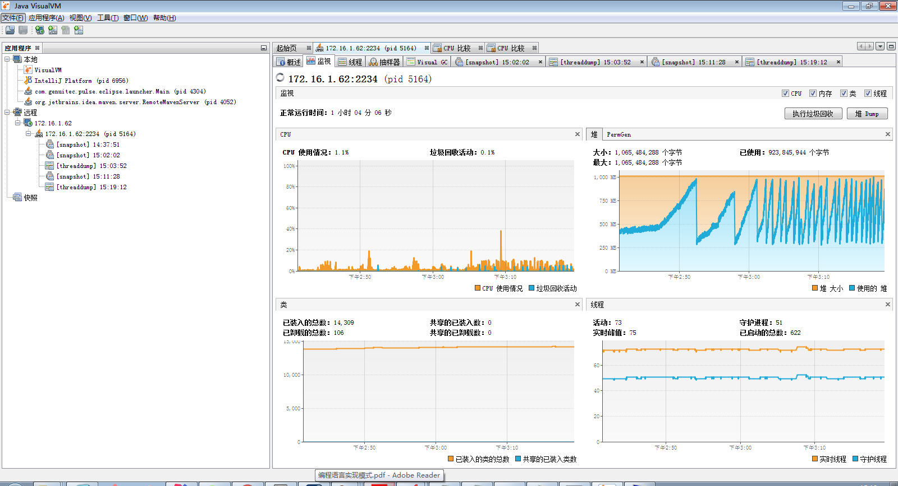
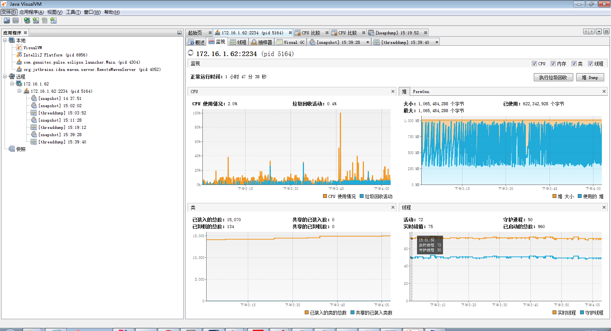

# EP内存泄露问题检测

1. 使用JDK自带的VisualVM性能分析工具，对服务器进行远程连接与监控。

- 找到TOMCAT_HOME/bin/catalina.bat，并对其进行添加

  > set JAVA_OPTS= -Dcom.sun.management.jmxremote=true -Dcom.sun.management.jmxremote.port=2234 -Dcom.sun.management.jmxremote.ssl=false -Dcom.sun.management.jmxremote.authenticate=false -Djava.rmi.server.hostname=50.112.22.47

 -Dcom.sun.management.jmxremote=true ： 确定远程连接

 -Dcom.sun.management.jmxremote.port=2234 ：指定JMX启动的代理端口，这个端口就是Visual VM要链接的端口

 -Dcom.sun.management.jmxremote.ssl=false ：指定JMX是否启用ssl

-Dcom.sun.management.jmxremote.authenticate=false ：指定JMX是否启用鉴权（需要用户名，密码授权）

 -Djava.rmi.server.hostname=50.112.22.47：指定JMX远程连接的IP

如图所示：

- 对tomcat进行启动，并在命令行窗口之中输入命令 ：netstat -ano | findstr 2234 ，用于查看端口2234是否已经启动

如图所示：

- 客户端进行telnet，在命令行窗口中输入命令：telnet 172.16.1.62 2234 ， 看该端口是否能够连接 

- 若能够连接，使用VisualVM，选择JMX连接

2.连接到远程服务器，开始监视tomcat

- 启动tomcat一段时间后，采集tomcat的堆缓存跟PermGen数据

##### 情景1

**堆** 

**结论** ：在下午3:00开始过后，垃圾回收变得十分频繁，在cpu视图中，可以看出，垃圾回收活动在cpu使用率上开始增加并变得逐渐频繁。

##### 情景2

**堆**

在3:10之后不断重复出现垃圾回收，而且出现着垃圾的大量产生与大量回收。值得注意的地方还有出现cpu的使用情况大部分都是被垃圾回收活动所使用，这就是说，服务器现在主要处理的并不是应用的业务，而是在不断回收垃圾。很明显，这不是我们想要的结果。

此时我们可以得出的**结论**应该是应用总是会产生在不断产生大量的，生命短暂的小对象。

###### Q&A 

1.cpu使用情况并不总是跟垃圾回收活动吻合，那为什么说大部分都是被垃圾回收活动所使用？

**答** ：从上面这两张图来看，cpu偶尔会出现小高峰，但是垃圾回收活动占用的情况不是特别明显，比如：在下午3:10 这里cpu使用情况突然飙升，这是因为我在执行堆Dump啦。因为我要采集数据到硬盘上，方便进行采样与比较。可当我并没有采集数据的时候，cpu使用情况都是与垃圾回收活动情况相切合。

2.为什么在重启2个小时之后，垃圾回收活动才开始变得频繁？

**答**：此应用主要的业务就是同步数据，在两个小时之后，也就是3点多的时候，猜测是业务办理与同步数据的高峰期。当时在查看后台的业务日志时，确实业务处理的高峰期。

#### 情景3

**堆**

第三个情景里面，堆的垃圾回收活动已完全爆满，并且cpu已经完全被垃圾回收活动所完全占满。其实这也是意料之中的事情。通过此前三种情景，我们完全可以推断得出，由于JVM之中的年轻代设置的太小，使得大量生命短暂的小对象，被迫的存入年老代，这才使得JVM总是在不断的进行Full GC。

但其实这是十分要命的。因为Full GC，不仅使cpu集中于垃圾回收，并且还会使JVM停顿，也就是说当前所有业务都将被暂停。

#### 解决方案

增大年轻代的内存。从后面的监视来看，堆与cpu的使用，还算满意。

**堆**

